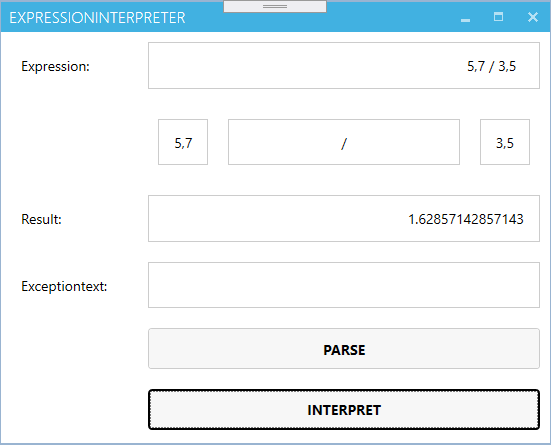
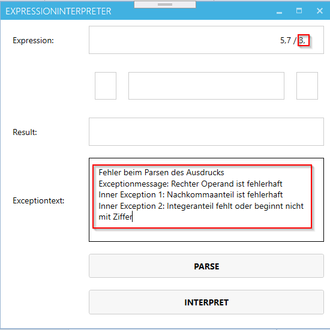
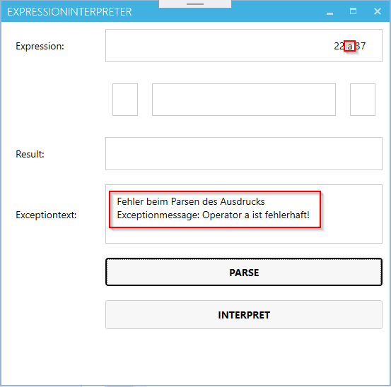
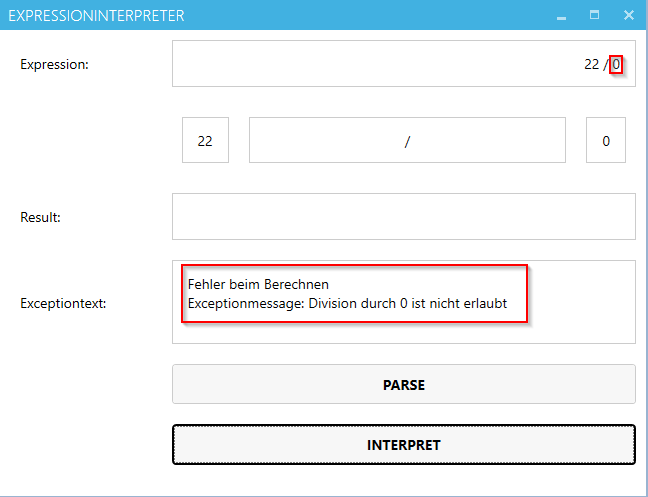

# Expression Interpreter

## Lehrziele

* Exception Handling
* Erster Kontakt mit GUI-Programmierung

## Grundanforderung

Es ist eine kleine WPF-Anwendung (mit eigener Logikschicht) zu erstellen, welche einfache mathematische Ausdrücke verarbeiten kann.

 

Diesmal können Sie nicht davon ausgehen, dass keine Eingabe- und Datenfehler gemacht werden. Alle möglichen Fehler sind dem Benutzer entsprechend mitzuteilen.

Folgende Randbedingungen sind zu berücksichtigen:

  * Jeder Ausdruck hat genau zwei Operanden (leftOperand, rightOperand) und einen Operator (op)
  * Jeder Operand kann eine Ganzzahl oder eine Gleitkommazahl sein. Bei Gleitkommazahlen muss vor und hinter dem Komma eine Ziffer stehen
  * Vor, zwischen und hinter den Operanden und dem Operator können beliebig viele (auch null) Leerzeichen stehen
  * Bei der Auswertung des Ausdrucks ("parsen") ist Codeverdopplung natürlich zu vermeiden (Beispiele: Parsen linker und rechter Operand, Parsen einer Zahl)
  * Der Ausdruck muss dem folgenden Muster entsprechen, um gültig zu sein:
	
    ```
    { }[-]{ }D{D}[,D{D}]{ }(+|-|*|/){ }[-]{ }D{D}[,D{D}]{ }
    ```
  * Beispiele für Ausdrücke
    * Fehlerfrei:
      ```
      "      5,7 / 3,5  "
      ```
    * Operator fehlerhaft:
      ```
      " 22 a 37  "
      ```
    * Fehlerhaft:
      ```
      "5,7 / 3,  "
      ```
    * Division durch Null:
      ```
      "22 / 0.0  "
      ```


Zu behandelnde Fehlersituationen:


  * Parsen des Ausdrucks
    * Die jeweiligen Detailfehlermeldungen müssen über InnerExceptions verwaltet werden!
    * Die Fehlermeldung liefert alle InnerExceptions!

      

 

  * Berechnung des Ergebnisses
    * Fehlerhafter Operator

      

 
    * Division durch Null

      

 
## Unittests

Unittests überprüfen die Funktionalität des Expressioninterpreters. 
